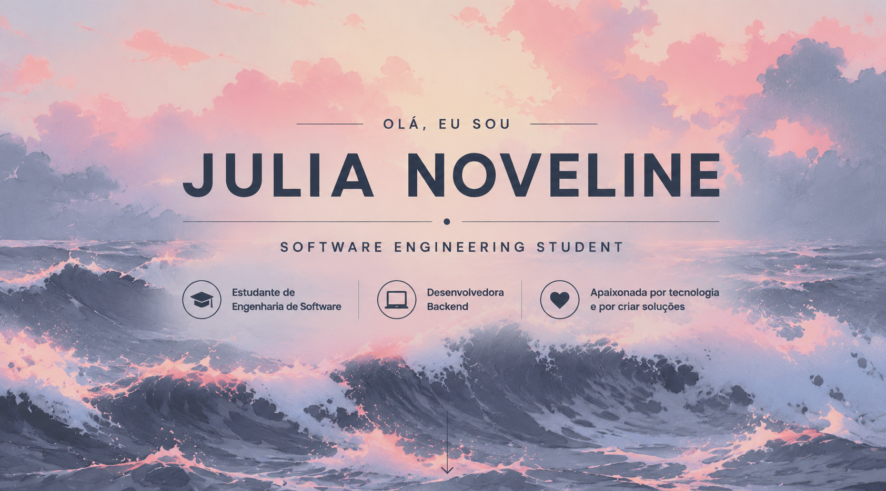

<!-- ========================= BANNER ========================= -->

  

---

<h2 align="center">Sobre Mim</h2>

Sou estudante de **Engenharia de Software** e estagiária na área de **Tecnologia da Informação**, atuando no desenvolvimento e manutenção de sistemas corporativos baseados em tecnologias Microsoft.

Participo da implementação de novas funcionalidades, correção de defeitos, desenvolvimento de consultas SQL, procedures e manutenção de aplicações **ASP.NET Web Forms**, contribuindo para a evolução contínua de sistemas utilizados em ambiente corporativo.

Tenho interesse em **desenvolvimento fullstack**, **arquitetura de software**, e **boas práticas de engenharia de software**.

Atualmente estou aprofundando meus conhecimentos em:

- C#
- VB.NET
- ASP.NET Web Forms
- SQL Server
- Python
- Engenharia de Software
- AWS
- HTML
- CSS
- JavaScript
- BootStrap

Meu objetivo é contribuir para o desenvolvimento de soluções robustas, escaláveis e de alta qualidade, aprimorando continuamente minhas habilidades técnicas.

---

<h2 align="center">Tecnologias</h2>

---

<h2 align="center">Estatísticas</h2>

---

<h2 align="center">Projetos em Destaque</h2>

<table align="center">
<tr>
<td width="50%">

### Site de academia

 Bootstrap • JavaScript • CSS • SQL Server • Dockerfile • HTML

Site utilizado para gerenciamento uma academia fictícia de jiu jitsu, mostrando os serviços oferecidos pela mesma.

<a href="(https://github.com/julianoveline015/Sirev.git)">Ver Projeto</a>

</td>

<td width="50%">

### Sistema de contatos

Java • MySQL • JavaScript • SprinBoot

Este projeto tem como objetivo demonstrar a estrutura básica de uma aplicação Spring Boot CRUD

<a href="(https://github.com/julianoveline015/Agenda-de-contatos.git)">Ver Projeto</a>

</td>
</tr>
</table>

---

<h2 align="center">Sequência de Contribuições</h2>

---

<h2 align="center">Atividade no GitHub</h2>

---

<h2 align="center">Contato</h2>

---

<i>"Aprender continuamente é a base para construir soluções de qualidade."</i>

<i>"Queime os barcos!"</i>

